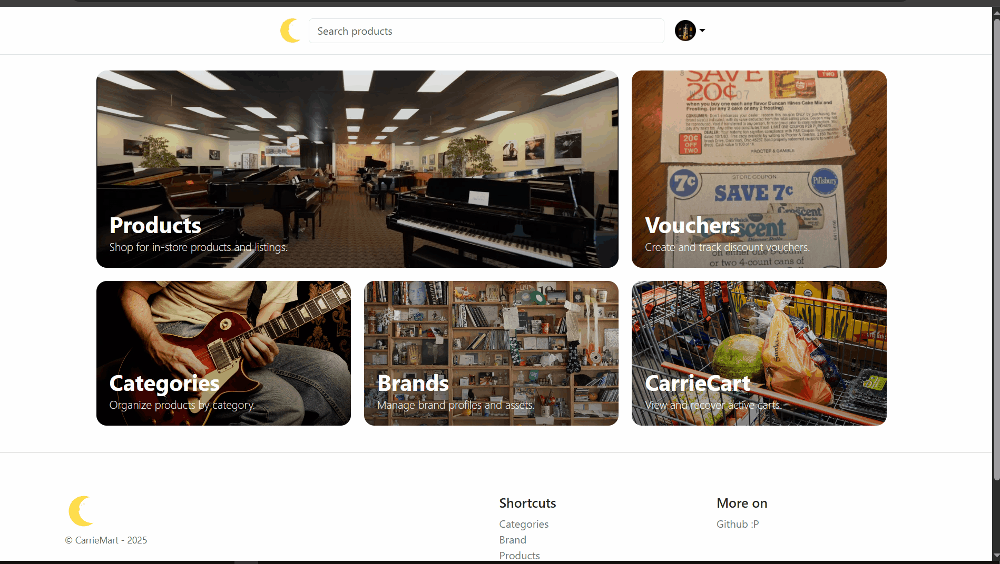

	

	

<h2 align="center">CarrieMart</h2>

	A PHP/MySQL e‑commerce web app for musical instruments and pro audio gear.

CarrieMart is a PHP/MySQL e‑commerce web application built for selling musical instruments and related gear. It includes customer side-pages, shopping cart and checkout, as well as an admin side-pages for managing products, brands, categories, orders, employees, vouchers, and reports.

---

## Demo

Home page

Browse / shop‑now page

Product filtering & search

Customer sign‑in / log‑in

Customer order list & details

Admin dashboard & management

---

## Features

- Customer side for product browsing, filtering, and search
- Product detail pages with images, pricing, and ratings
- Shopping cart, checkout flow, vouchers, and order history
- Product reviews and returns management
- Admin panel for accounts, products, brands, categories, suppliers
- Inventory tracking and automatic expense records for stock purchases
- Basic sales and expense reports
- Email sending support via PHPMailer and Mailtrap

---

## Project Structure

Key folders in this repository:

- root index: entry point and router ([index.php](index.php))
- customer UI: main storefront pages ([main/](main))
- customer side: login, register, profile, cart, orders, returns, reviews ([user/](user))
- admin panel: management pages for accounts, employees, products, orders, reports ([admin/](admin))
- shared includes: DB config, headers, authentication helpers, mailer ([includes/](includes))
- assets: static images, icons, and branding ([assets/](assets))
- uploads: uploaded product, brand, category, and profile images ([uploads/](uploads))
- sql: database schema and seeding scripts ([sql/](sql))
- demo: animated GIFs used in this README ([demo/](demo))

---

## Database Overview

The database schema is defined in [sql/schema.sql](sql/schema.sql). Major tables include:

- `accounts` – customer and admin user accounts
- `products`, `brands`, `categories`, `suppliers`, `product_photos` – catalog and inventory
- `cart`, `cart_product` – persistent carts per user
- `orders`, `product_order`, `order_return` – orders, line items, and returns
- `product_review` – verified product reviews and ratings
- `vouchers` – discount codes used at checkout
- `employees`, `positions`, `salaries` – internal staff management
- `expenses` – tracked business expenses (inventory purchase, rent, etc.)

There is also a `order_transaction_details` view for simplified reporting across orders and products.

---

## Setup & Installation

1. Clone this repository into your web server root (e.g. `htdocs` for XAMPP).
2. Create a MySQL database and user (or use the defaults in includes/config.php).
3. Import the schema:
	- Open phpMyAdmin or the MySQL CLI.
	- Run the script in [sql/schema.sql](sql/schema.sql).
4. Adjust database credentials in [includes/config.php](includes/config.php) if needed.
5. (Optional) Seed demo data:
	- Open [sql/seed_demo_data.php](sql/seed_demo_data.php) in your browser at `http://localhost/carriemart/sql/seed_demo_data.php`.
	- This will insert sample brands, categories, suppliers, and products.
6. Visit the storefront:
	- `http://localhost/carriemart/main/index.php` or simply `http://localhost/carriemart/`
7. Visit the admin panel (after creating an admin account directly in the DB if needed):
	- `http://localhost/carriemart/admin/`

---

## Email

Email sending is implemented via PHPMailer in [send-email.php](send-email.php) and configured using Mailtrap credentials defined in [includes/config.php](includes/config.php). This is intended for development and testing. I left the credentials blank for anyone wanting to try those themselves.

---

